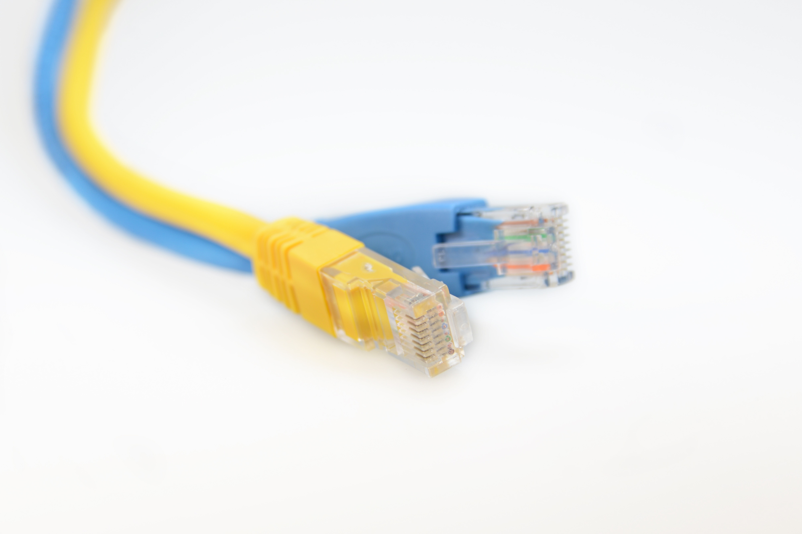

## El connector

El connector utilitzat per a cables de pars trenats Ethernet és el RJ 45.
Cal tindre amb compter la numeració dels pins.

## El cable

El cable està format per 4 pars identificats amb colors:

* blau / blau-blanc
* taronja / taronja-blanc
* verd / verd-blanc
* marró / marró-blanc

## Estàndards de pin-out

Per assignar cables als pins dels connectors hi ha 2 estàndars:

* T568A
* T568B

## Crimpat

Una vegada inserit cada cable en la posició correcta, s'utilitza la crimpadora:

## Gràcies per la vostra atenció

### ¿Dubtes?

